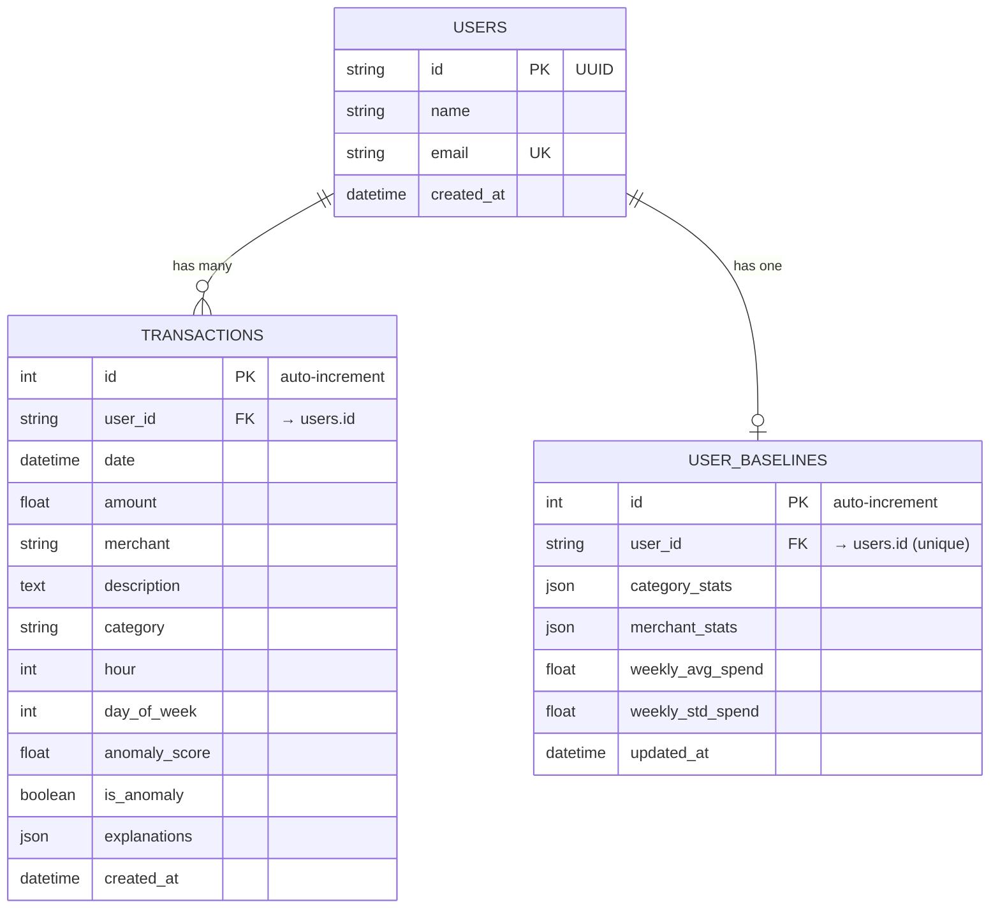

# Entity-Relationship Diagram

> Reflects the actual database schema implemented in `finance_anomaly_backend/app/models.py`.

```mermaid
erDiagram

    USERS {
        string id PK "UUID"
        string name
        string email UK
        datetime created_at
    }

    TRANSACTIONS {
        int id PK "auto-increment"
        string user_id FK "→ users.id"
        datetime date
        float amount
        string merchant
        text description
        string category
        int hour
        int day_of_week
        float anomaly_score
        boolean is_anomaly
        json explanations
        datetime created_at
    }

    USER_BASELINES {
        int id PK "auto-increment"
        string user_id FK "→ users.id (unique)"
        json category_stats
        json merchant_stats
        float weekly_avg_spend
        float weekly_std_spend
        datetime updated_at
    }

    USERS ||--o{ TRANSACTIONS : "has many"
    USERS ||--o| USER_BASELINES : "has one"
```